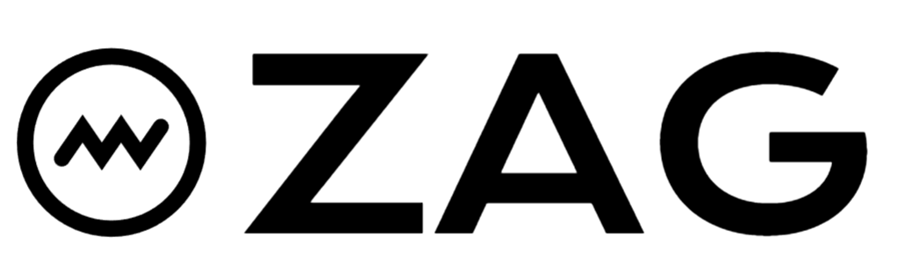

<div align="center">



[](https://badge.fury.io/py/zagpy)
[](https://pypi.org/project/zagpy/)
[](https://github.com/YOUR_USERNAME/zag-ai/blob/main/LICENSE)
[](https://pypi.org/project/zagpy/)

**A simple, yet flexible, RAG framework.**

Zag provides modular, composable components for building production-ready RAG pipelines. From document reading to retrieval and post-processing, every component is designed to be simple, transparent, and extensible.

</div>

---

## Core Features

### 📄 Multiple Document Readers

Support for various document formats with high-quality extraction:

```python
from zag.readers import DoclingReader, MarkItDownReader, MinerUReader

# Read PDF with Docling (high quality, structure-aware)
reader = DoclingReader()
doc = reader.read("document.pdf")

# Read with MarkItDown (lightweight, fast)
reader = MarkItDownReader()
doc = reader.read("document.docx")

# Read with MinerU (OCR-powered, handles complex layouts)
reader = MinerUReader()
doc = reader.read("scanned.pdf")
```

### ✂️ Smart Document Splitting

Intelligent splitting strategies that preserve document structure:

```python
from zag.splitters import MarkdownHeaderSplitter, RecursiveMergingSplitter

# Split by markdown headers
splitter = MarkdownHeaderSplitter()
units = splitter.split(doc)

# Recursive merging with token limits
base_splitter = MarkdownHeaderSplitter()
merger = RecursiveMergingSplitter(
    base_splitter=base_splitter,
    target_token_size=512
)
units = merger.split(doc)
```

### 🏷️ Metadata Extraction

Extract structured information from documents automatically:

```python
from zag.extractors import KeywordExtractor, StructuredExtractor, TableExtractor

# Extract keywords
extractor = KeywordExtractor(llm_uri="openai/gpt-4o-mini")
keywords = extractor.extract(unit)

# Extract structured data
extractor = StructuredExtractor(llm_uri="openai/gpt-4o-mini")
metadata = extractor.extract(unit, schema=MySchema)

# Extract tables
extractor = TableExtractor()
tables = extractor.extract(doc)
```

### 🗄️ Dual Indexing

Combine vector and full-text search for comprehensive retrieval:

```python
from zag.indexers import VectorIndexer, FullTextIndexer

# Vector indexing
vector_indexer = VectorIndexer(
    embedder=embedder,
    vector_store=vector_store
)
vector_indexer.index(units)

# Full-text indexing (requires Meilisearch: https://github.com/meilisearch/meilisearch)
fulltext_indexer = FullTextIndexer(
    host="http://localhost:7700",
    api_key="master_key"
)
fulltext_indexer.index(units)
```

### 🔍 Hybrid Retrieval

Fuse results from multiple retrieval sources:

```python
from zag.retrievers import VectorRetriever, FullTextRetriever, FusionRetriever

# Create retrievers
vector_retriever = VectorRetriever(vector_store=vector_store, embedder=embedder)
fulltext_retriever = FullTextRetriever(index_name="documents")

# Fuse results with RRF (Reciprocal Rank Fusion)
fusion_retriever = FusionRetriever(
    retrievers=[vector_retriever, fulltext_retriever],
    fusion_strategy="rrf",
    k=60
)
results = fusion_retriever.retrieve("query", top_k=10)
```

### 🎯 Post-Processing Pipeline

Flexible post-processing with filters, rerankers, and augmentors:

```python
from zag.postprocessors import (
    SimilarityFilter,
    Deduplicator,
    TokenCompressor,
    ContextAugmentor,
    Reranker,
    ChainPostprocessor
)

# Build processing chain
pipeline = ChainPostprocessor([
    SimilarityFilter(threshold=0.5),        # Filter by similarity
    Deduplicator(),                          # Remove duplicates
    Reranker(uri="local/bge-reranker-v2"),  # Rerank results
    ContextAugmentor(),                      # Add surrounding context
    TokenCompressor(max_tokens=2000)         # Compress to token limit
])

results = pipeline.process(results)
```

---

## 🚀 Quick Start

### Installation

```bash
pip install zagpy
```

### Basic RAG Pipeline

```python
from zag.readers import DoclingReader
from zag.splitters import MarkdownHeaderSplitter
from zag.embedders import Embedder
from zag.storages import ChromaVectorStore
from zag.indexers import VectorIndexer
from zag.retrievers import VectorRetriever

# Read document
reader = DoclingReader()
doc = reader.read("document.pdf")

# Split into units
splitter = MarkdownHeaderSplitter()
units = splitter.split(doc)

# Create vector store
embedder = Embedder(uri="bailian/text-embedding-v3")
vector_store = ChromaVectorStore(collection_name="my_docs")

# Index units
indexer = VectorIndexer(embedder=embedder, vector_store=vector_store)
indexer.index(units)

# Retrieve
retriever = VectorRetriever(vector_store=vector_store, embedder=embedder)
results = retriever.retrieve("What is RAG?", top_k=5)
```

---

## 📚 Detailed Documentation

### Readers

Readers convert various document formats into Zag's unified document schema:

| Reader | Format | Best For | Example |
|--------|--------|----------|---------|
| **DoclingReader** | PDF, DOCX, PPTX, HTML | High-quality extraction, structure preservation | [docling_example.py](examples/readers/docling_example.py) |
| **MarkItDownReader** | DOCX, XLSX, PPTX, PDF | Lightweight, fast conversion | [markitdown_example.py](examples/readers/markitdown_example.py) |
| **MinerUReader** | PDF (scanned, complex) | OCR, complex layouts, scientific papers | [mineru_example.py](examples/readers/mineru_example.py) |

**Example:**
```python
from zag.readers import DoclingReader

reader = DoclingReader()
doc = reader.read("document.pdf")
print(f"Title: {doc.metadata.get('title')}")
print(f"Content: {doc.content[:200]}...")
```

See complete examples: [examples/readers/](examples/readers/)

---

### Splitters

Splitters divide documents into semantically meaningful units:

| Splitter | Strategy | Best For | Example |
|----------|----------|----------|---------|
| **MarkdownHeaderSplitter** | Split by markdown headers | Structured documents with clear hierarchy | [markdown_header_example.py](examples/splitters/markdown_header_example.py) |
| **RecursiveMergingSplitter** | Recursive merging with token limits | Token-aware splitting, preserving context | [recursive_merging_example.py](examples/splitters/recursive_merging_example.py) |

**Example:**
```python
from zag.splitters import MarkdownHeaderSplitter

splitter = MarkdownHeaderSplitter()
units = splitter.split(doc)

for unit in units:
    print(f"Header: {unit.metadata.get('header')}")
    print(f"Tokens: {unit.metadata.get('token_count')}")
```

See complete examples: [examples/splitters/](examples/splitters/)

---

### Extractors

Extractors enrich documents and units with structured metadata:

| Extractor | Purpose | Output | Example |
|-----------|---------|--------|---------|
| **KeywordExtractor** | Extract key terms | List of keywords | [keyword_structured_example.py](examples/extractors/keyword_structured_example.py) |
| **StructuredExtractor** | Extract structured data | Pydantic model instance | [keyword_structured_example.py](examples/extractors/keyword_structured_example.py) |
| **TableExtractor** | Extract tables from documents | Parsed table data | [table_example.py](examples/extractors/table_example.py) |

**Example:**
```python
from zag.extractors import KeywordExtractor

extractor = KeywordExtractor(llm_uri="openai/gpt-4o-mini")
keywords = extractor.extract(unit)
print(f"Keywords: {keywords}")
```

See complete examples: [examples/extractors/](examples/extractors/)

---

### Parsers

Parsers convert extracted data into structured formats:

| Parser | Input | Output | Example |
|--------|-------|--------|---------|
| **TableParser** | Markdown tables in TextUnit | TableUnit with structured json_data | [table_basic_example.py](examples/parsers/table_basic_example.py) |

**Example:**
```python
from zag.parsers import TableParser

parser = TableParser()
table_units = parser.parse_from_unit(text_unit)
print(table_units[0].json_data)  # {'headers': [...], 'rows': [...]}
```

See complete examples: [examples/parsers/](examples/parsers/)

---

### Embedders

Embedders convert text into vector representations:

```python
from zag.embedders import Embedder

# Use provider/model URI format
embedder = Embedder(uri="bailian/text-embedding-v3")
vectors = embedder.embed(["Hello world", "Another text"])
```

**Supported Providers:**
- Bailian (Alibaba Cloud)
- More providers coming soon

See complete example: [bailian_example.py](examples/embedders/bailian_example.py)

---

### Indexers

Indexers store units in vector or full-text search engines:

| Indexer | Storage Type | Best For | Example |
|---------|-------------|----------|---------|
| **VectorIndexer** | Vector database | Semantic search | [vector_example.py](examples/indexers/vector_example.py) |
| **FullTextIndexer** | Meilisearch | Keyword search, filters | [fulltext_example.py](examples/indexers/fulltext_example.py) |

**Example:**
```python
from zag.indexers import VectorIndexer
from zag.embedders import Embedder
from zag.storages import ChromaVectorStore

embedder = Embedder(uri="bailian/text-embedding-v3")
vector_store = ChromaVectorStore(collection_name="docs")

indexer = VectorIndexer(embedder=embedder, vector_store=vector_store)
indexer.index(units)
```

See complete examples: [examples/indexers/](examples/indexers/)

---

### Storages

Storage backends for vector and unit data:

| Storage | Type | Backend | Example |
|---------|------|---------|---------|
| **ChromaVectorStore** | Vector | ChromaDB | [vector_store_example.py](examples/storages/vector_store_example.py) |

**Example:**
```python
from zag.storages import ChromaVectorStore

vector_store = ChromaVectorStore(
    collection_name="my_collection",
    persist_directory="./chroma_db"
)
```

See complete example: [vector_store_example.py](examples/storages/vector_store_example.py)

---

### Retrievers

Retrievers fetch relevant units based on queries:

| Retriever | Type | Strategy | Example |
|-----------|------|----------|---------|
| **VectorRetriever** | Vector | Semantic similarity | - |
| **FullTextRetriever** | Full-text | Keyword matching | [fulltext_example.py](examples/retrievers/fulltext_example.py) |
| **FusionRetriever** | Hybrid | RRF, weighted sum, linear combination | [fusion_example.py](examples/retrievers/fusion_example.py) |

**Example:**
```python
from zag.retrievers import FusionRetriever, VectorRetriever, FullTextRetriever

# Combine multiple retrievers
retriever = FusionRetriever(
    retrievers=[
        VectorRetriever(vector_store=vector_store, embedder=embedder),
        FullTextRetriever(index_name="docs")
    ],
    fusion_strategy="rrf",
    k=60
)

results = retriever.retrieve("What is machine learning?", top_k=10)
```

See complete examples: [examples/retrievers/](examples/retrievers/)

---

### Post-Processors

Post-processors refine retrieval results:

| Type | Component | Purpose | Example |
|------|-----------|---------|---------|
| **Filter** | SimilarityFilter | Remove low-similarity results | [comprehensive_example.py](examples/postprocessors/comprehensive_example.py) |
| **Filter** | Deduplicator | Remove duplicate results | [comprehensive_example.py](examples/postprocessors/comprehensive_example.py) |
| **Reranker** | Reranker | Rerank with cross-encoder | [comprehensive_example.py](examples/postprocessors/comprehensive_example.py) |
| **Augmentor** | ContextAugmentor | Add surrounding context | [comprehensive_example.py](examples/postprocessors/comprehensive_example.py) |
| **Compressor** | TokenCompressor | Compress to token limit | [comprehensive_example.py](examples/postprocessors/comprehensive_example.py) |
| **Composite** | ChainPostprocessor | Sequential processing | [comprehensive_example.py](examples/postprocessors/comprehensive_example.py) |

**Example:**
```python
from zag.postprocessors import ChainPostprocessor, SimilarityFilter, Reranker, TokenCompressor

pipeline = ChainPostprocessor([
    SimilarityFilter(threshold=0.5),
    Reranker(uri="local/bge-reranker-v2"),
    TokenCompressor(max_tokens=2000)
])

refined_results = pipeline.process(results)
```

See complete example: [comprehensive_example.py](examples/postprocessors/comprehensive_example.py)

---

## 🔄 End-to-End Example

See a complete RAG pipeline with all components working together:

```python
# 1. Read document
doc = DoclingReader().read("document.pdf")

# 2. Split into units
units = MarkdownHeaderSplitter().split(doc)

# 3. Extract metadata
for unit in units:
    unit.metadata['keywords'] = KeywordExtractor().extract(unit)

# 4. Index
indexer = VectorIndexer(embedder=embedder, vector_store=vector_store)
indexer.index(units)

# 5. Retrieve
retriever = VectorRetriever(vector_store=vector_store, embedder=embedder)
results = retriever.retrieve("query", top_k=10)

# 6. Post-process
pipeline = ChainPostprocessor([
    SimilarityFilter(threshold=0.5),
    Reranker(uri="local/bge-reranker-v2"),
    TokenCompressor(max_tokens=2000)
])
final_results = pipeline.process(results)
```

See complete example: [rag_example.py](examples/e2e/rag_example.py)

---

## Architecture

Zag follows a modular, pipeline-based architecture:

**Indexing Pipeline:**
```
Document → Reader → Splitter → Extractor → Indexer → Storage
```

**Retrieval Pipeline:**
```
Query → Embedder → Retriever ← Storage → Post-Processor → Results
```

**Key Design Principles:**

1. **Modularity**: Every component is independent and replaceable
2. **Composability**: Components connect through clear interfaces
3. **Flexibility**: Support multiple providers and strategies
4. **Transparency**: No magic, explicit control flow
5. **Type Safety**: Pydantic models throughout

---

## 🙏 Acknowledgments

Zag is built on top of excellent open-source projects:

- [Chak](https://github.com/zhixiangxue/chak-ai) - LLM gateway and conversation management
- [Docling](https://github.com/docling-project/docling/) - High-quality document parsing
- [MarkItDown](https://github.com/microsoft/markitdown) - Lightweight document conversion
- [MinerU](https://github.com/opendatalab/MinerU) - OCR and complex layout extraction
- [ChromaDB](https://github.com/chroma-core/chroma) - Vector database
- [Meilisearch](https://github.com/meilisearch/meilisearch) - Full-text search engine

---

<div align="right">

</div>
